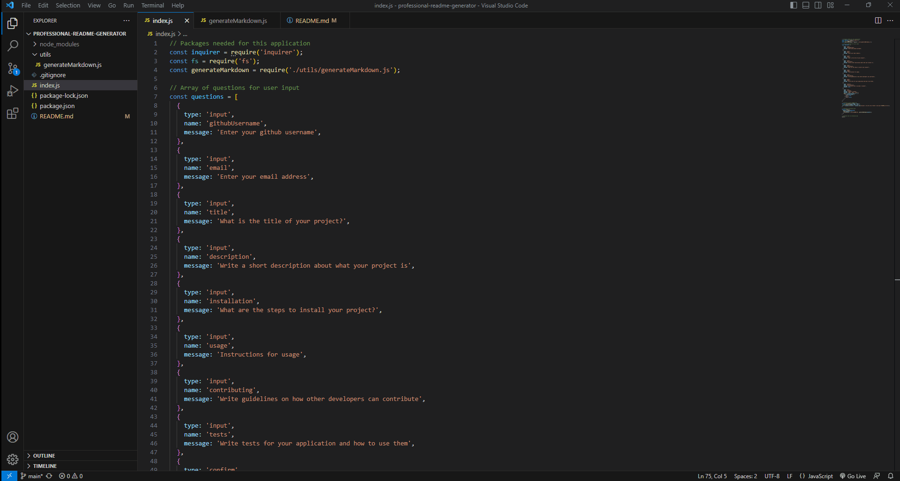

# professional-readme-generator

## Description

This is a professional README generator, where you can go into your terminal and  type "node index.js". Then you will be prompted with a series of questions about what you want to add you your README for example title, description, table of contents, installation, usage, etc. Once you finish with all the questions you then will get a message that your README file has been successfully and you can now go into the utils folder and see your newly created README file.

## Built With

* JavaScript
* NodeJS

## Installation

To install this app you will need to run npm install to get the inquirer package. This will allow you to get the questions prompted and be able to answer them to be able to create a README file.

## Usage

## Walkthrough Video

[Link](https://drive.google.com/file/d/1g8xHsyYafQ7WqINgyAFU97oSmZkBKXjt/view)
